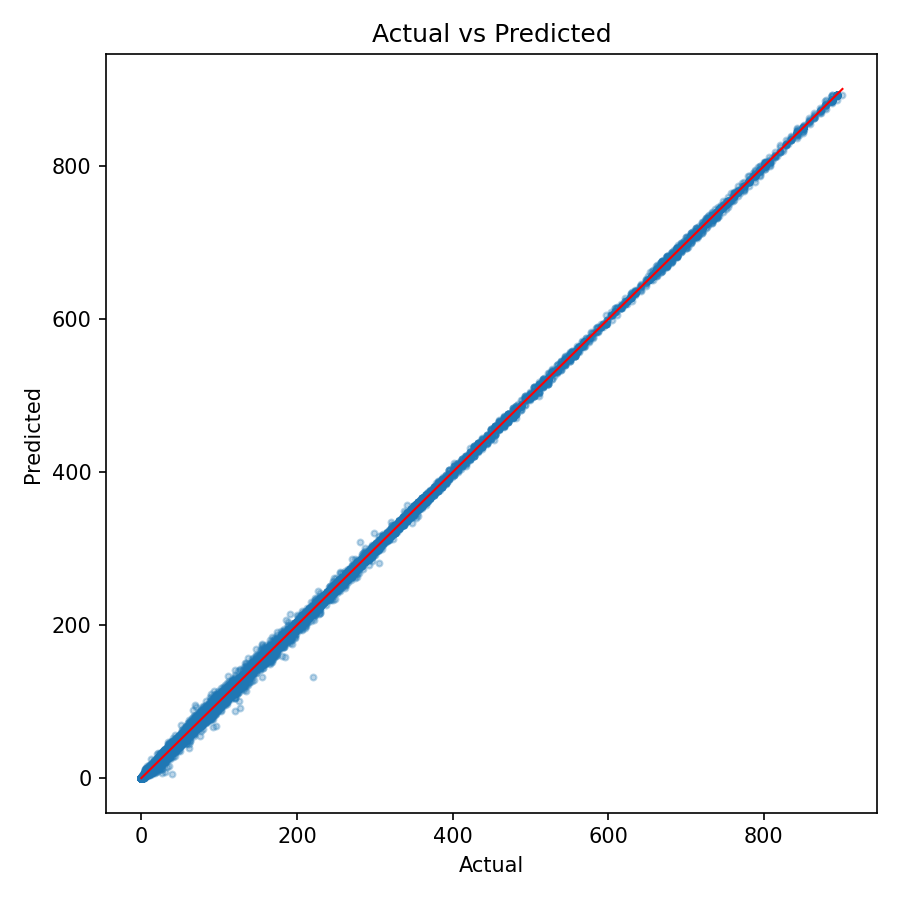
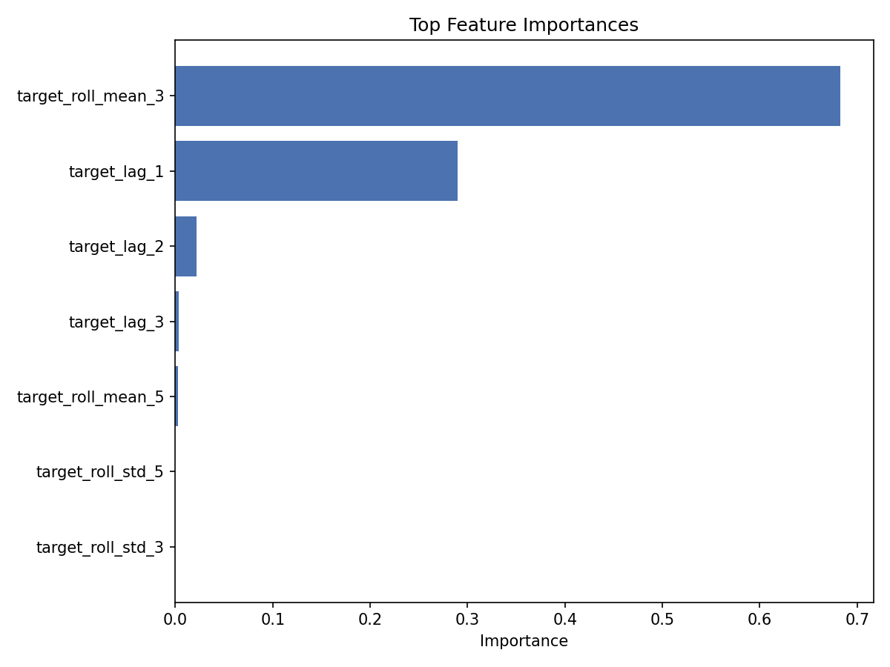

## Rock Leachate Analysis: From Exploration to Deployment

This project presents an academic, end-to-end machine learning workflow for
predicting rock leachate measurements using time-aware feature engineering and
rigorous validation. The pipeline is fully reproducible and structured to
mirror a research-grade study, including data requirements, methodology,
modeling, and evaluation.

### Project Overview

Rock leachate chemistry evolves over time and is influenced by prior states.
To capture this temporal dependence, the project engineers lag and rolling
statistics per rock sample and evaluates generalization using a strict
Leave-One-Rock-Out (LORO) protocol.

### Objectives

- Predict leachate measurements from time-indexed rock samples.
- Engineer lag and rolling features to capture temporal dynamics.
- Validate generalization across unseen rocks using LORO.
- Provide clear, reproducible training and evaluation scripts.

### Data Description

The dataset is expected to be a time series per rock sample. Each sample is
identified by a `rock_id`, ordered by `timestamp`, and associated with a
continuous target variable (`target`).

Required columns:

- `rock_id`: unique identifier per rock
- `timestamp`: time ordering column (string or datetime)
- `target`: leachate measurement to predict

Optional numeric columns are used as additional predictors.

### Methodology

1. **Preprocessing**
   - Parse timestamps and sort by `rock_id` and `timestamp`.
   - Remove rows with missing values after feature creation.

2. **Feature Engineering**
   - Lag features of the target (e.g., t-1, t-2, t-3).
   - Rolling statistics (mean, standard deviation) over configurable windows.

3. **Model**
   - XGBoost Regressor for nonlinear relationships in structured data.
   - Hyperparameters defined in `config/project.yaml`.

4. **Validation**
   - Leave-One-Rock-Out cross-validation to prevent leakage between rocks.
   - Metrics: R^2, MAE, RMSE.

### Results (Current Run)

Using the current dataset in `data/raw/leachate.csv`, the mean LORO metrics are:

- R^2: 0.983
- MAE: 2.653
- RMSE: 7.427

Supporting visualizations:




### Repository Structure

- `data/raw/` - raw input data (not committed)
- `data/processed/` - processed data outputs
- `config/` - configuration files
- `src/` - feature engineering, training, and evaluation code
- `models/` - saved model artifacts
- `reports/` - figures and writeups
- `notebooks/` - exploratory analysis

### Reproducibility

Setup:

```bash
python3 -m venv .venv
source .venv/bin/activate
pip install -r requirements.txt
```

Run validation:

```bash
python -m src.validate --config config/project.yaml
```

Train final model:

```bash
python -m src.train --config config/project.yaml
```

### Notes

- Update `config/project.yaml` if your column names differ.
- Metrics will change with different datasets; re-run validation for reporting.
